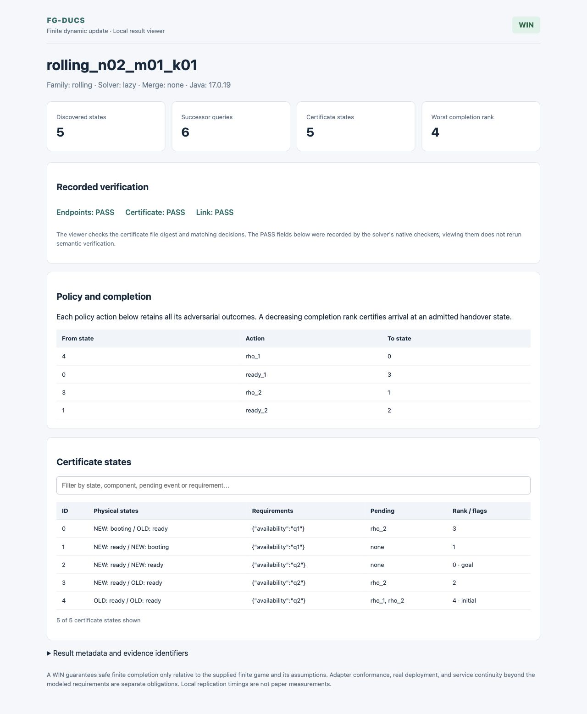

# Synthesizing Staged Updates between Verified Controllers

**Compile local component transfers and individual requirement lifetimes into a safe, completing update policy between supplied controllers.** This is the public, anonymous replication package prepared by the paper's authors for this study. It contains the FG-DUCS tool, all reported models and evidence, and reproducible checks. It is an anonymous research prototype, not a deployment framework. The [paper-matched release, `fgducs-c79-20261003`](https://github.com/research-artifact-archive/research-artifact/tree/fgducs-c79-20261003) bundles the corresponding main paper, integrated supplementary material and source evidence. It records the current manuscript, without claiming a completed conference submission. The [claim-to-evidence map](docs/CLAIMS.md) identifies the files and reproduction commands for this snapshot.

| What would you like to do? | Start here | What you get |
|---|---|---|
| **Use the tool** | [Build and run](#use-the-tool) · [`tool/`](tool/) | A checked update policy or a losing-region certificate, plus a readable local result viewer |
| **Reproduce the study** | [Reproduction](#reproduce-the-study) · [`reproduce/`](reproduce/) | Saved-evidence checks, source builds, finite examples, and the original benchmark protocols |
| **Understand the evidence** | [Results and interpretation](#results-and-interpretation) · [`results/`](results/) | The complete positive, negative, invalid, timeout, OOM and unexecuted outcomes |
| **Read the formal account** | [Paper](paper/main.pdf) · [Integrated supplementary material](paper/supplementary_material.pdf) | Definitions, assumptions, proofs, measurement details and threats to validity |

```text
tool/        Source code, inherited FSP models, build/run commands, result viewer
reproduce/   Checks, campaign scripts/configurations, solver variants, layout map
results/     Evidence grouped by question, with large raw logs in lossless archives
paper/       Anonymous PDF snapshots and their TeX/generated tables
docs/        Input guide, reproduction details, interpretation and packaging notes
```

The 18-page main text develops synthesis for staged handover between supplied controllers: the Cell input and whole policy, Policy input primitives and opposing requirement orders, local-history/game correspondence, endpoint continuation, requirement interpretation, an independent granularity analysis before certifying synthesis, source-derived cases and all principal positive and negative results. The 29-page technical appendix follows the argument from proofs and cases through interpretation and execution to comparisons and evidence records. The separate 48-page S1–S5 supplement preserves the experimental records. The 78-page integrated supplement adds a one-page reading guide. All three documents remain available for inspection; the main text identifies the assumptions and evidence limits needed to assess its claims.

## Read the paper and its appendices

Reference **[4], FG-DUCS Evaluation Artifact**, in the main paper refers to this authors' package. **Technical Appendix A–P and Supplement S1–S5 are included here**, as Parts I and II of the [integrated supplementary material](paper/supplementary_material.pdf).

| Reference in the paper | Open this document | Where to look |
|---|---|---|
| Main paper | [Main PDF](paper/main.pdf) | Sections 1–10; Introduction and Conclusion frame the contribution |
| Technical Appendix A–P | [Part I, integrated PDF](paper/supplementary_material.pdf#page=2) · [Separate appendix](paper/technical_appendix.pdf) | Continuous PDF pages 2–30: complete proofs, input definitions and interpretation analyses |
| Supplement S1–S5 | [Part II, integrated PDF](paper/supplementary_material.pdf#page=31) · [Separate supplement](paper/supplement.pdf) | Continuous PDF pages 31–78: witnesses, validation, all results and expanded comparisons |
| Figure 2: states, solver time, peak JVM RSS | [All 135 saved result cells](paper/source/build/generated/rq3-cells.csv) · [Plot generator](paper/source/scripts/generate_rq3_paired_plot.py) | All 14 completed Lazy/Direct-Full pairs; the other 13 Direct-Full contracts remain timeouts in Table 4 and Appendix O |
| A specific claim or check | [Claim-to-evidence map](docs/CLAIMS.md) · [Appendix section index](paper/README.md#appendix-section-index) | Exact section, evidence path and reproduction command |

The integrated PDF starts with a linked reading guide and has bookmarks and continuous page numbers. Download **main.pdf** and **supplementary_material.pdf** into the same folder to follow relative links from the main paper. If a browser ignores a `#page=` link, use the printed continuous page number or the PDF bookmarks.

The [original `fgducs-invariants-20261002` evidence snapshot](https://github.com/research-artifact-archive/research-artifact/tree/fgducs-invariants-20261002) is preserved and is also identified in Data Availability. It includes earlier manuscript PDFs. Use the **paper-matched release above** for the revised paper's appendix references and page numbers; the original tag has not been moved.

## What problem does it solve?

A running system can need several changes while continuing to satisfy safety conditions. Updating everything together can create a transient violation; keeping every old requirement active until the end can also prevent a valid update. FG-DUCS makes component transfers and old/new requirement boundaries separate controllable events. A transfer can have multiple possible outcomes. The synthesized policy must work from **every admitted old entry**, retain **every adversarial outcome** of each chosen event, respect uncontrollable priority, and finish at an admitted state of the **fixed new controller**.

The inputs are finite old/new component models, fixed endpoint controllers and projections, local state-transfer relations, safety testers with explicit activation initializers, requirement lifetimes, precedence constraints and loadable new states. A **WIN** supplies a policy, completion ranks and handover targets. For finite JSON inputs, a **LOSS** saves the checked losing-region membership in `certificate.json`. The FSP/application benchmark driver checks that region internally but saves only its size and phase-mask statistics; its full-game export supports independent reconstruction, without comparing the solver's membership list. **INVALID** means the declared contract failed validation; it is not a losing game. A timeout or OOM establishes neither WIN nor LOSS.

Update commands and handover require global modeled uncontrollable quiescence; permanently enabled uncontrollable behavior can prevent completion. No fairness assumption is made.

The guarantee is relative to this finite game. Real execution additionally requires correct adapters, transfer implementations, observation histories and endpoint projections. These obligations are not established by the experiments. The current tool does not claim live deployment, practitioner benefit, or service continuity beyond the supplied requirements.

## Use the tool

Use **Python 3.10+**, a **64-bit JDK 17**, **Maven**, and **Git**. A source build downloads dependencies from their upstream locations; allow several minutes and several GB of disk. No solver or third-party JAR is redistributed. [LICENSE](LICENSE) and [NOTICE](NOTICE) explain the source and dependency terms.

### 1. Build the finite-example solver

Run commands from this repository's root. Use a new output directory for each build and run:

```sh
python3 tool/build.py --variant e1 --output work/e1
```

This verifies and copies the source into a work area, applies the complete E1 source patch, downloads hash-checked upstream dependencies, and builds the JAR. The E1 variant provides the explicit finite-model adapter and merging operations used in the granularity experiments. `baseline`, `e2` and `e5` select the other measured source variants. Each patch is applied to a fresh baseline, never on top of another patch. The build compiles tests but skips their execution.

### 2. Run the small Rolling example

```sh
python3 tool/run.py \
  --jar "work/e1/Implementation/Source Code/maven-root/mtsa/target/mtsa-1.0-SNAPSHOT.jar" \
  --input results/granularity/e6/rolling/v1/inputs/rolling_n02_m01_k01.json \
  --merge none --output work/rolling-fine
```

There are two replicas and at least one must remain ready. Updating one replica, waiting for its ready report, and then updating the other permits safe completion. The expected result is **WIN**. Open `work/rolling-fine/report.html` in a browser. This offline viewer shows the actual recorded decision, checks, policy actions, ranks and searchable certificate states.



Now run the same input with its transfer events merged:

```sh
python3 tool/run.py \
  --jar "work/e1/Implementation/Source Code/maven-root/mtsa/target/mtsa-1.0-SNAPSHOT.jar" \
  --input results/granularity/e6/rolling/v1/inputs/rolling_n02_m01_k01.json \
  --merge transfers --output work/rolling-merged
```

The expected result is **LOSS**: simultaneously starting both replicas violates the availability tester. Open `work/rolling-merged/report.html` to inspect its losing-region evidence.

[Screenshot of the actual local LOSS result](docs/images/rolling-loss.jpg). The report includes every saved certificate state and the sampled losing-entry action buckets.

The runner defaults to a **2 GiB heap** and **60-second whole-JVM limit**. `--heap`, `--timeout`, `--solver lazy|direct_full`, and `--merge none|transfers|boundaries|both` make the choice explicit. Exit 0 means checked WIN; checked LOSS uses exit 2. Because argument errors also use exit 2, inspect `replication.json` for `CHECKED_LOSS`. A timeout uses exit 124. Each fresh output preserves `input.json`, `result.json`, `certificate.json`, logs, the actual JAR/input/certificate hashes, run configuration and `report.html`. A local source build is not asserted byte-identical to a measured JAR; new runs are not added to paper timings.

The screenshots above come from actual local functional runs of the published source. The viewer verifies the certificate file digest and decision match; its displayed semantic PASS values are those recorded by the native checkers. Viewing a report does not rerun those checks. You can also render an existing finite result with:

```sh
python3 tool/view_result.py --result path/to/result.json --output new-report.html
```

### 3. Supply your own contract or use the inherited GUI

Start from the small JSON example and read the [finite input schema](results/granularity/e6/common/SCHEMA.md) and [input guide](docs/INPUTS.md). Encode all transfer outcomes and the exact requirement lifetimes. Do not use the model's physical initial state as a substitute for all admitted old entries. Merging can invalidate a contract if it collapses strict precedence or noncommuting monitor observations; such cases must remain INVALID.

For the inherited FSP frontend and Java GUI, build the baseline and launch it:

```sh
python3 tool/build.py --variant baseline --output work/baseline
java -jar "work/baseline/Implementation/Source Code/maven-root/mtsa/target/mtsa-1.0-SNAPSHOT.jar"
```

Open `tool/models/GSM_FG.lts`, choose `UPDATE_CONTROLLER_OTF_FG`, and click **Compose (`||`)**. The file's opening comments identify the R1/R2 target variants. **Transitions**, **Draw** and **Animation** inspect the result. The GUI is the existing MTSA frontend; the browser screenshots above show the new result viewer for the explicit finite-model runner. A headless inherited-model example is documented in [reproduction details](docs/REPRODUCTION.md).

## Results and interpretation

All results below are saved observations, not newly selected measurements. Counts include the negative and unresolved cases. The [paper snapshot](paper/main.pdf) and [integrated supplement](paper/supplementary_material.pdf) state the formal assumptions; the tables below explain what the evidence does and does not establish.

### Why fine granularity can matter

Five constructed families expose different update constraints, including both directions of the granularity comparison. They are models inspired by update patterns, not measurements of deployed products or estimates of how often the problem occurs in practice.

| Family | Mechanism and result | Interpretation and boundary |
|---|---|---|
| **Rolling** | 70 startup-availability threshold cells agree with `k ≤ n − m`, where `k` is the group starting together and `m` the required ready capacity | The spare capacity limits safe update granularity; reports and the readiness model are assumptions |
| **Canary** | 15/15 local-versus-merged pairs separate when all transfer outcomes, uncontrollable reports and recovery are modeled | A successful branch alone is insufficient; recovery behavior is supplied in the model |
| **Policy v2** | Audit overlap and role nonoverlap require opposite requirement-boundary orders | A single global boundary does not express this contract directly; this is a boundary-order result, not a service-continuity guarantee |
| **DB-Rolling v2** | Secondary-first maintenance separates; no-slack controls are both LOSS | Granularity helps only when the contract provides a safe intermediate state |
| **Rolling+Audit** | Transfer merging can lose under the startup-capacity constraint, while requirement-boundary merging wins in the same family | Finer granularity is not uniformly beneficial: the result depends on which commands are merged and on the declared requirement scopes |

The main E6 denominator is **55 pairs: 33 fine-WIN/merged-LOSS, 11 both-LOSS, 10 both-WIN, and 1 incomplete pair**. It also includes Audit, Threads and PC2 cases. The 20 scale pairs, 12 Canary assumption-control pairs, nine Cell reference pairs, and additional PC2 budget attempts are separate; they are not added to 55. The 70 threshold cells and 15 Canary pairs above overlap these analyses and are not 85 independent applications. Canonical versions are **Policy v2** and **DB-Rolling v2**. Earlier versions, rejected checker attempts, counterexamples and failed preparation attempts remain available.

For PC2, the fine model wins but the measured merged attempts time out, including extended budgets. A separate structural argument identifies a joint-calibration safety obstruction. That argument is **not** a measured solver LOSS. Joint transfer domains exist in all 81 independently checked old-product states, so empty transfer domains are not the explanation.

See [all granularity evidence](results/granularity/), [main pair index](results/granularity/e6/results_index.csv), [independent game checks](results/granularity/e6/independent/), and [Rolling's analytic check](results/granularity/e6/rolling/ANALYTIC_CHECK.md).

### Important null results and diagnostics

| Experiment | Complete reported outcome | What it supports |
|---|---|---|
| **E1: inherited Base/R1 merging** | 54 comparisons, **0 decision changes**; discovered states decrease in 44 and are unchanged in 10 | The inherited models do not demonstrate necessity of fine granularity; the constructed families address a different evidence gap |
| **E2: full construction with UC pruning** | Mac: 16 WIN, 1 LOSS, 10 TO; separate Xeon campaign: 15 WIN, 12 TO | Helps distinguish full construction and UC pruning; this is an incomplete two-factor comparison because on-the-fly exploration without UC pruning is not implemented. Host, budget and repetition differences prevent pooling |
| **E4: finite fixtures / Cell** | Controlled separations; corrected Cell series has 45 trials; original 30 input errors are retained | Mechanism-level evidence, not deployment prevalence; input errors are not LOSS |
| **E5: physical-initial-only transfers** | 18 pairs: **0 separations**, 6 both-LOSS, 2 both-WIN, 10 incomplete; 54 planned jobs: 4 WIN, 12 LOSS, 9 TO, 29 NOT_RUN_DEADLINE | Restricting transfer domains does not automatically create a useful witness under UC quiescence |
| **E6: constructed families** | 55 pairs as above; positive cases and null/negative controls all retained | Establishes that the modeled distinctions can change solvability under the stated assumptions |

[E1/E2 data and scripts](results/ablation/) and [E4/E5 data and scripts](results/granularity/) preserve their separate budgets and denominators. We do not describe an independently unidentified “E3” campaign as completed, or present E1–E6 as a single homogeneous experiment.

### Fixed-budget solver comparison: 27 contracts

The fixed comparison uses nine adapted inputs derived from eight source models, with three contracts each, a **64 GiB Java heap** and **1,200-second whole-JVM cap** on the recorded Xeon host. Conditions that complete consistently have **five repetitions**; first-stage failures remain single attempts. The following are same-FG-game methods:

| Method | WIN | LOSS | TO | Decided |
|---|---:|---:|---:|---:|
| **Lazy** | 25 | 1 | 1 | **26/27** |
| **Eager** | 17 | 0 | 10 | **17/27** |
| **Update-first** | 23 | 1 | 3 | **24/27** |
| **Direct-Full** | 14 | 0 | 13 | **14/27** |

Lazy materializes controllable buckets on demand; Eager queries them at expansion time. Both preserve all outcomes of a chosen bucket and use UC priority. Eager can stop before the full game is discovered. Update-first changes the controllable-action order. Direct-Full is an in-house full-construction comparator for the same FG objective, including fixed-new-controller handover; it is not an external DUCS implementation.

Figure 2 adds the saved **sampled peak JVM resident memory (RSS, MiB)** for the same 14 completed Lazy/Direct-Full pairs. All 14 Lazy medians are lower: Direct-Full/Lazy ratios range from **1.01 to 36.94**, with median **1.95**. Each range spans the five trial peaks. These are Windows JVM-process working-set samples taken every 0.1 seconds over the whole run, including frontend and endpoint preparation, not heap occupancy or solver-only memory. Some ranges overlap, so this is not a claim of statistically significant separation in every pair. Other methods can use less memory: Eager does so in 1/17 completed pairs and Update-first in 12/24. The 13 Direct-Full timeouts are excluded from completed-pair medians and remain in the all-contract results.

The result supports completion of more fixed-budget cases by Lazy. It does **not** say Lazy is always fastest: **Update-first has a smaller solver-time median in 8/24 completed comparisons**. In the Travel scaling grid the three on-the-fly methods each finish **20/48** conditions and Direct-Full finishes **18/48**. Other scaling grids, states, queries, RSS and timings are included in the [generated tables](paper/source/build/generated/) and [scaling analyses](results/performance/analysis/).

**Separate legacy reference:** the saved DUCS implementation fork gives **9 WIN, 13 OOM, and 5 author-instrumentation capture stops (N/M)**. It solves a different GR objective and does not enforce this fixed-new-controller handover. Do not interpret that row as a same-objective speed comparison. Existing DUCS can encode intermediate update stages; no objective-preserving translation, encoding-effort comparison or external-solver study is supplied here.

<details><summary><b>All 27 fixed-budget contracts (solver medians in seconds; expand)</b></summary>

| Model / contract | Lazy | Eager | Update-first | Direct-Full |
|---|---:|---:|---:|---:|
| gsm / base | W 0.0224 | W 0.0332 | W 0.0233 | W 0.0416 |
| gsm / r1 | W 0.0228 | W 0.0348 | W 0.0243 | W 0.045 |
| gsm / r2 | W 0.0201 | W 0.0281 | W 0.0225 | W 0.0327 |
| industry / base | W 0.19 | W 14.5 | W 0.542 | W 154 |
| industry / r1 | L 562 | TO | L 461 | TO |
| industry / r2 | W 1.15 | W 2.96 | W 0.455 | W 28 |
| metasocket / base | W 0.0149 | W 0.0302 | W 0.0165 | W 0.0408 |
| metasocket / r1 | W 0.0136 | W 0.0278 | W 0.0147 | W 0.0426 |
| metasocket / r2 | W 0.0152 | W 0.018 | W 0.0154 | W 0.024 |
| powerplant / base | W 0.0463 | W 0.487 | W 0.052 | W 1.85 |
| powerplant / r1 | W 0.125 | W 1.08 | W 0.152 | W 5.51 |
| powerplant / r2 | W 0.18 | W 0.251 | W 0.114 | W 1.01 |
| productioncell_arms1 / base | W 0.0741 | W 26 | W 0.886 | W 157 |
| productioncell_arms1 / r1 | W 0.0793 | W 188 | W 3.15 | TO |
| productioncell_arms1 / r2 | W 6.16 | W 12.2 | W 1.17 | W 77.8 |
| productioncell_arms2 / base | W 2.61 | TO | TO | TO |
| productioncell_arms2 / r1 | W 2.6 | TO | TO | TO |
| productioncell_arms2 / r2 | TO | TO | TO | TO |
| railcab / base | W 0.169 | TO | W 2.26 | TO |
| railcab / r1 | W 3.18 | TO | W 6.74 | TO |
| railcab / r2 | W 15.5 | W 38.7 | W 4.16 | W 283 |
| surveillance / base | W 2.01 | TO | W 2.63 | TO |
| surveillance / r1 | W 18.6 | TO | W 126 | TO |
| surveillance / r2 | W 37.1 | TO | W 16.1 | TO |
| workflow / base | W 0.111 | W 508 | W 0.116 | TO |
| workflow / r1 | W 0.325 | TO | W 0.215 | TO |
| workflow / r2 | W 16.1 | W 23.9 | W 3.18 | TO |

`W` = WIN, `L` = LOSS, `TO` = timeout. Times are solver medians from five complete repetitions, not whole-JVM times. The original interrupted Workflow/R2 Direct-Full run and its separately recorded same-setting TO are both preserved. The full CSV also includes state/query/policy counts, process RSS, all five timings and the separate legacy reference.

</details>

### Extended budgets: ext1–7

These are follow-up diagnostics with their own single-run budgets. They **do not replace the fixed table, change its five-run medians, or turn censored observations into ratios**.

| Campaign | Result | Interpretation |
|---|---|---|
| **ext1**: Travel frontier | 4 WIN | Some fixed-budget boundary cases are solvable with more time |
| **ext2**: Direct-Full CPU extension | 1 WIN, 1 LOSS | PC1/R1 and Industry/R1 decisions agree with fixed Lazy |
| **ext3**: next Travel conditions | 1 WIN, 4 TO | Extra time helps one further case; four remain unresolved |
| **ext4**: 200 GiB heap | 1 WIN, 10 TO, 1 OOM | A larger heap and longer time limit still leave unresolved cases |
| **ext5**: Travel, 200 GiB | 2 TO, 2 SKIP | Skipped conditions are explicitly unexecuted, not timeouts |
| **ext6**: Legacy, 200 GiB / 3,600 s | 11 OOM, 7 instrumentation-profile stops; 0 decisions, 18 attempts | Profile stops are N/M, not evidence of a general Legacy capacity limit |
| **ext7**: Eager, 200 GiB / 7,200 s | 3 WIN, 1 LOSS, 5 TO, 1 OOM; 10 attempts | Four decisions match fixed Lazy; three WINs resolve cases where the 200 GiB Direct-Full extension remained undecided |

ext1–5 comprise **27 planned conditions: 7 WIN, 1 LOSS, 16 TO, 1 OOM, 2 SKIP, 0 pending**. All seven campaigns have their [original configuration and per-run data](results/performance/raw/), including stderr, environment and negative outcomes. The [extended-budget CSV](paper/source/build/generated/ext-budget.csv) records each condition’s heap limit and 7,200-second whole-JVM cap for ext1–5.

The three completed ext7 WINs are Railcab/base, Workflow/R1 and Surveillance/R2; the LOSS is Industry/R1. Eager discovers approximately **60–68,186 times** as many states as fixed Lazy on those three WINs. These are discovered-state counters, **not full-game sizes**, and Eager need not visit the same states as Full+UC. ext7 timings are single-run values, not medians. RSS is sampled process memory, not Java-heap occupancy. TO/OOM cells have no final state count and receive no state ratio.

### Correctness and scope checks

The saved correctness suite contains **46 models** with independently derived expectations: **18 WIN, 24 LOSS, 4 INVALID**, tested in 92 jobs. The formal witness suite adds **14 jobs: 10 WIN, 4 LOSS**. The no-Java reproduction also checks drawn witness edges and transfers, 27 declared contract sizes, completion ranks, frontend lookup, quiescent goals, loadable targets and a separate contract-repair example. That repair wins from all 131 admitted roots while preserving the original 42 losing entries as a separate result; it does not replace the original contract's LOSS.

The core finite E6 independent checker reconstructs endpoint products and whole games in Python, with saved audits of 182 completed core trials over 148 distinct input/merge games and 12 rejected corrupt-certificate controls. Additional checks cover the newer canonical versions and controls. The Java native checker shares frontend/semantic code with the solver; all implementations and independent checks are from the same author team. These checks increase confidence but do not establish implementation correctness for every possible input.

## Reproduce the study

### A. Check the saved evidence (no Java; recommended first)

```sh
python3 -m venv .venv
. .venv/bin/activate
python3 -m pip install -r reproduce/requirements.txt
python3 reproduce/check.py --output work/evidence-check
```

On Windows activate `.venv\Scripts\activate` instead. Use Python 3.10+ and allow several minutes plus about **2 GB** of free disk. The command verifies file/part hashes, restores a fresh traditional workspace, rederives the finite expectations, checks the saved correctness and supplement evidence, rebuilds the fixed tables/scaling figures, and checks the E-series/ext1–7 aggregates and finite certificates. Matplotlib is needed for the figure check. Any FAIL or SKIP is not a complete reproduction success. Logs and JSON reports are written only under the new output directory. No Java benchmark is rerun and no network is used after Python dependency installation.

Large baseline raw logs are supplied as ordinary Git files in three lossless archive parts; **there are no missing release assets or Git LFS downloads**. The materializer checks every part and extracted file, rejects unsafe paths and existing output directories, and restores the original research-script paths:

```sh
python3 reproduce/materialize.py --output work/full-workspace
```

This compatibility workspace keeps archived scripts unchanged while the public repository remains organized by purpose. [`reproduce/layout.json`](reproduce/layout.json) maps each public file or archived member to its workspace path. New `work/` outputs are ignored by Git. Unpacking data is not a benchmark rerun.

The saved-evidence command also checks the revised paper displays. For that subset alone, run `python3 -B reproduce/check_paper_displays.py`. Its fourteen checks cover PC2 values, the granularity table, all 108 outcome tiles, the 14 paired absolute costs and their Base/R1/R2 strata, Cell states/edges and requirement bands, and Policy states/edges and requirement bands against the saved inputs and certificate, without running Java. A separate all-thirteen PC2 check replays all 870 saved old/policy observer edges, binds every old entry, and checks the source invariants from their reached starts through handover. [Paper build instructions](paper/README.md) explain how to rebuild the main paper, technical appendix and supplement with stable cross-references.

### B. Rerun functional examples

Use the [build/run commands above](#use-the-tool). Source variant definitions, exact measured source commits and original measured JAR digests are in [`reproduce/solver-variants/variants.json`](reproduce/solver-variants/variants.json). The portable runner records the actual rebuilt JAR hash instead of incorrectly attributing a local build to the measured binary. A new run can reproduce a decision and checked certificate without reproducing timing or byte-identical serialization.

### C. Repeat the performance experiments

Start from a fresh materialized workspace, fetch dependencies and build the required variant. The original [Xeon campaign](reproduce/campaign/), [validation protocol](reproduce/validation-protocol/), [ablation scripts](results/ablation/scripts/), [finite-family generators/runners](results/granularity/e6/) and [extended configurations](results/performance/configs/) are included. See [exact preparation and command sequence](docs/REPRODUCTION.md).

A complete performance rerun is expensive: the fixed campaign uses 64 GiB heaps and censored cells, and later extensions use up to 200 GiB, 7,200 seconds per condition and a recorded minimum 240 GiB physical-memory requirement. Use comparable hardware and preserve the recorded CPU/JVM/parallelism settings if comparing times. The scripts expose planning/dry-run modes. Write new configurations/results into new directories, preserve all planned conditions and failures, and keep replications separate from the archived paper observations. Source builds and upstream dependency availability are portability limits; the original measured fat JARs are not distributed.

## Reading the repository and its limits

- [`results/README.md`](results/README.md) maps each question to models, raw data, certificates and table generators.
- [`docs/REPRODUCTION.md`](docs/REPRODUCTION.md) explains the old path layout, campaign variants, metrics and reruns.
- [`docs/PACKAGING.md`](docs/PACKAGING.md) states exactly what is archived, anonymized or omitted, and distinguishes historical design notes from final observations.
- [`paper/`](paper/) is a reproducible snapshot, not a promise that an experimental candidate draft is the final submission. The public evidence is usable without access to private author notes.

The evidence supports the specified finite synthesis problem, constructed granularity separations and the reported budgeted implementation results. It does not establish equivalence to every DUCS encoding, an external-solver advantage, adapter/history correctness, typicality of these examples, or practical user/deployment outcomes. No human-subject evaluation is reported. Generative AI assisted research design, implementation, experiment scripts, analysis and writing as described in the paper's methods; all reported observations come from saved executions and explicit checks.
